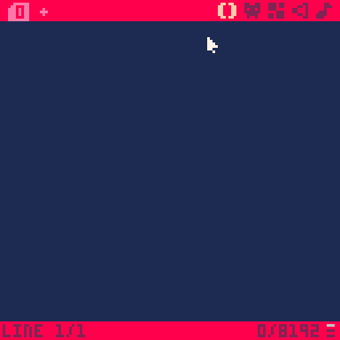
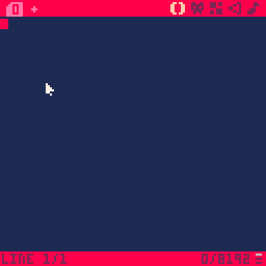
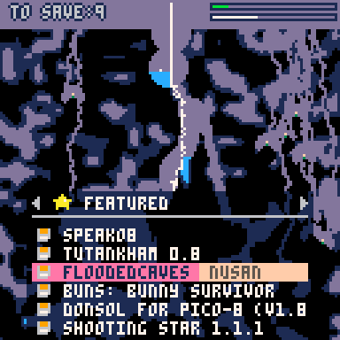
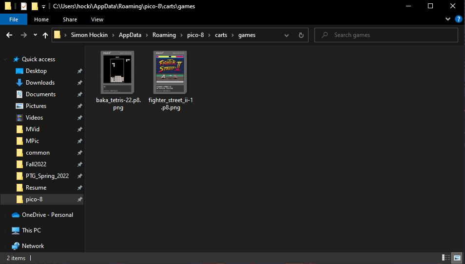

# Welcome to Hello PICO-8!

A gif of me loading and running a game downloaded from the PICO-8 carts website

A gif of me pasting code from an existing PICO-8 game into the programming interface and running it.

A gif of me typing the code "print('hello Simon')" and running it.

A gif of me navigating the SPLORE menu in PICO-8.

A screenshot of the PICO-8 folder that contains my .p8 files.

